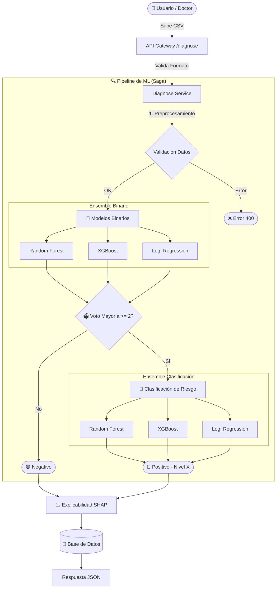

# Miel-IA - API de Diagnóstico Médico Inteligente 🧠

Miel-IA es una API RESTful de alto rendimiento diseñada como sistema de soporte al diagnóstico médico. Su núcleo integra modelos de aprendizaje automático (Machine Learning) orquestados mediante el patrón Saga para analizar estudios de electromiografía (EMG) y detectar patrones asociados al Síndrome de Guillain-Barré.

Este proyecto destaca por una arquitectura robusta, segura y modular, preparada para escalar desde un monolito modular hacia microservicios.

---

## 🚀 Características Principales

### 🛡️ Seguridad y Autenticación
- **JWT (JSON Web Tokens)**: Autenticación segura y sin estado (stateless).
- **RBAC (Role-Based Access Control)**: Gestión granular de permisos (Admin, Doctor, Investigador).
- **Argon2 Hashing**: Almacenamiento de contraseñas con estándares criptográficos modernos.
- **Recuperación Local**: Sistema de restablecimiento de credenciales gestionado localmente (para entornos de alta seguridad o sin salida SMTP).

### 🤖 Inteligencia Artificial y ML
- **Orquestación Saga**: Ejecución secuencial y coordinada de múltiples modelos predictivos.
- **Ensemble Voting**: Sistema de decisión por consenso utilizando:
  - Random Forest
  - XGBoost
  - Regresión Logística
- **Doble Capa de Análisis**:
  1. **Detección Binaria**: Presencia/Ausencia de patología.
  2. **Clasificación de Riesgo**: Evaluacion de severidad (ALTO, MEDIO, BAJO).

### 🏗️ Arquitectura Técnica
- **FastAPI**: Framework moderno y asíncrono para alto rendimiento.
- **SQLAlchemy & PostgreSQL**: Persistencia robusta y relacional.
- **Docker Ready**: Contenerización completa para despliegue consistente.
- **Clean Architecture**: Separación clara de responsabilidades (Rutas, Servicios, Repositorios).

### 📊 Diagrama de Flujo del Diagnóstico



---

## 🛠️ Stack Tecnológico

| Componente | Tecnología | Descripción |
|------------|------------|-------------|
| **Core API** | Python 3.10+, FastAPI | Motor asíncrono y tipado. |
| **Base de Datos** | PostgreSQL 15+ | Almacenamiento principal relacional. |
| **ORM** | SQLAlchemy | Abstracción de base de datos. |
| **ML Engine** | Scikit-learn, XGBoost | Entrenamiento e inferencia de modelos. |
| **Data Processing** | Pandas, NumPy | Manipulación eficiente de datos numéricos. |
| **Server** | Uvicorn | Servidor ASGI de producción. |

---

## 📋 Requisitos Previos

- Docker y Docker Compose
- Python 3.10 o superior (para ejecución local sin contenedores)
- Cliente PostgreSQL (opcional)

---

## 🚀 Instalación y Despliegue

### Opción A: Despliegue con Docker (Recomendado)

1. **Clonar el repositorio**:
   ```bash
   git clone <url-del-repo>
   cd miel-ia
   ```

2. **Configurar variables de entorno**:
   Crea un archivo `.env` basado en `.env-example`:
   ```bash
   cp .env-example .env
   ```

3. **Iniciar servicios**:
   ```bash
   docker-compose up -d --build
   ```

### Opción B: Ejecución Local

1. **Crear entorno virtual**:
   ```bash
   python -m venv venv
   source venv/bin/activate
   ```

2. **Instalar dependencias**:
   ```bash
   pip install -r requirements.txt
   ```

3. **Ejecutar migraciones y servidor**:
   ```bash
   alembic upgrade head
   uvicorn app.main:app --reload
   ```

---

## 🔐 Gestión de Accesos

### Recuperación de Contraseña
> [!NOTE]
> Miel-IA está configurado con máxima privacidad. **No utiliza servicios externos de email (SMTP)** para la recuperación de cuentas.

El proceso de restablecimiento se realiza de forma administrativa o local:
1. El usuario solicita recuperación vía API.
2. El administrador utiliza el script seguro de gestión:
   ```bash
   python reset_password.py
   ```
   Este script permite establecer una nueva contraseña directamente interactuando de forma segura con la base de datos.

---

## 🚧 Estado del Proyecto

**Versión Actual**: `0.1.0-beta`

> [!IMPORTANT]
> **En Proceso de Despliegue**: Actualmente se están realizando configuraciones finales en la infraestructura de producción. Es posible que el entorno de staging presente intermitencias momentáneas.

El desarrollo se encuentra activo, con foco en la optimización de los hiperparámetros de los modelos de clasificación.

---

## 👨‍💻 Autor

Desarrollado con ❤️ y código por **Pablo Mirazo**.
*Ingeniería de Software & Data Science*

> "La tecnología al servicio de la salud es el puente hacia un futuro con mejor calidad de vida."
