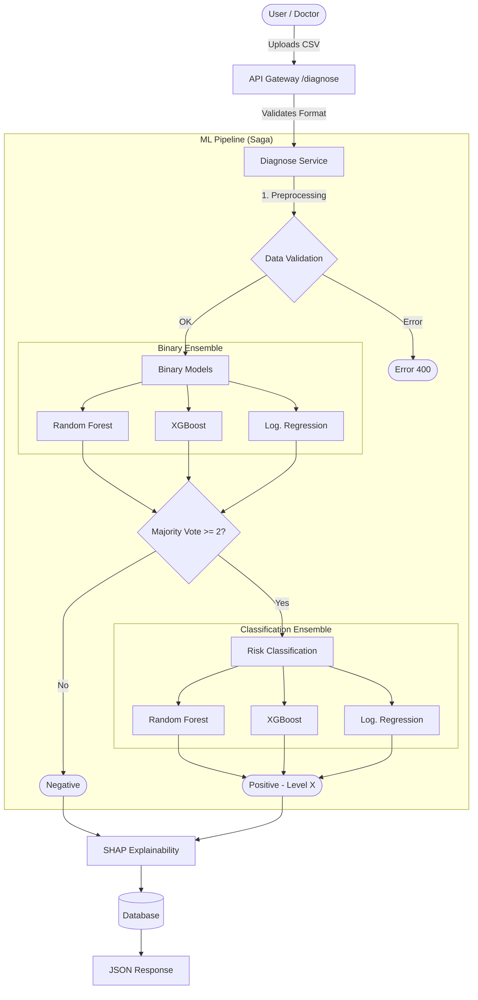

# Miel-IA - Intelligent Medical Diagnosis API

Miel-IA is a high-performance RESTful API designed as a medical diagnosis support system. Its core integrates Machine Learning models orchestrated via the Saga pattern to analyze electromyography (EMG) studies and detect patterns associated with Guillain-Barré Syndrome.

This project highlights a robust, secure, and modular architecture, ready to scale from a modular monolith to microservices.

Click here to go to the [**Frontend Repository**](https://github.com/mirazopablo/miel-ia-front)

---

## Key Features

###  Security and Authentication
- **JWT (JSON Web Tokens)**: Secure and stateless authentication.
- **RBAC (Role-Based Access Control)**: Granular permission management (Admin, Doctor, Researcher).
- **Argon2 Hashing**: Password storage with modern cryptographic standards.
- **Local Recovery**: Locally managed credential reset system (for high-security environments or without SMTP output).

###  Artificial Intelligence and ML
- **Saga Orchestration**: Sequential and coordinated execution of multiple predictive models.
- **Ensemble Voting**: Consensus decision system using:
  - Random Forest
  - XGBoost
  - Logistic Regression
- **Double Analysis Layer**:
  1. **Binary Detection**: Presence/Absence of pathology.
  2. **Risk Classification**: Severity evaluation (HIGH, MEDIUM, LOW).

###  Technical Architecture
- **FastAPI**: Modern and asynchronous framework for high performance.
- **SQLAlchemy & PostgreSQL**: Robust and relational persistence.
- **Docker Ready**: Complete containerization for consistent deployment.
- **Clean Architecture**: Clear separation of responsibilities (Routes, Services, Repositories).

###  Diagnosis Flow Diagram



---

## 🛠️Tech Stack

| Component | Technology | Description |
|-----------|------------|-------------|
| **Core API** | Python 3.12, FastAPI | Asynchronous and typed engine. |
| **Database** | mysql:8.0.40-bookworm | Primary relational storage. |
| **ORM** | SQLAlchemy | Database abstraction. |
| **ML Engine** | Scikit-learn, XGBoost | Model training and inference. |
| **Data Processing** | Pandas, NumPy | Efficient numerical data manipulation. |
| **Server** | Uvicorn | Production ASGI server. |

---

##  Prerequisites

- Docker and Docker Compose
- Python 3.12 (tested version, higher versions may not work because of NumPy)
- Compose for Mysql

---

##  Installation and Deployment

### Option A: Deployment with Docker (Recommended)

1. **Clone the repository**:
   ```bash
   git clone https://github.com/mirazopablo/miel-ia
   cd miel-ia
   ```

2. **Configure environment variables**:
   Create a `.env` file based on `.env-example`:
   ```bash
   cp .env-example .env
   ```

3. **Start services**:
   ```bash
   docker-compose up -d --build
   ```

### Option B: Local Execution

1. **Create virtual environment**:
   ```bash
   python -m venv venv
   source venv/bin/activate
   ```

2. **Install dependencies**:
   ```bash
   pip install -r requirements.txt
   ```

3. **Run migrations and server**:
   ```bash
   alembic upgrade head
   uvicorn app.main:app --reload
   ```

---


## Project Status

**Current Version**: `0.1`

> [!IMPORTANT]
> **Deployment in Process**: Final configurations are currently being made on the production infrastructure. The staging environment may experience momentary intermittency.

Development is active, focusing on optimizing the hyperparameters of the classification models.

---

## Author

Mirazo Pablo: Computer Engineering Student
